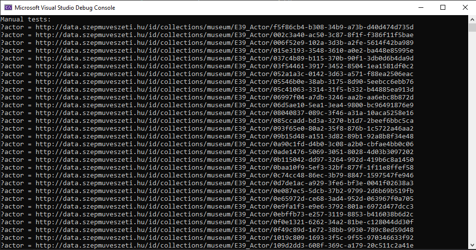
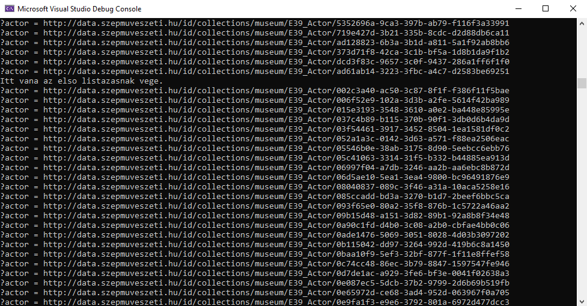
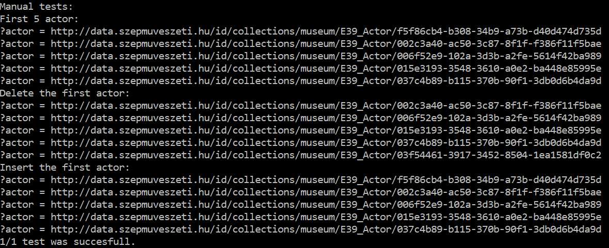

# Manuális tesztek megtervezése, végrehajtása és dokumentálása

Manuális tesztekkel az volt a célunk, hogy le tudjuk tesztelni egy nagy rész működését, ami a Unit tesztek által lefedett műveleteket tartalmaz.

### Terv

Úgy tervezzük, hogy a tesztben a laborokon is használt szépművészeti adatbázist fogjuk használni. Ezt fileból olvassuk be és utána műveleteket hajtunk rajta végre.
Lépések:
- Adatbázis beolvasássa fileból
- Actorok kilistázása
- Egy aktor eltávolítása
- Actorok kilistázása
- Aktor hozzáadása
- Aktorok kilistázása

### Végrehajtás

A végrehajtás során a beolvasást követően egy query segítségével kilistázzuk az actorokat. Az eltávolítást végrehajtó parancs végrehajtása után megfigyelhető, hogy nincsen az actorok között az eltávolított példány. Miután lefuttatom a hozzáadó parancsot látható, hogy újra megjelenik az actorok között a kívánt actor.

### Eredmények

Eredmény képpen elkészült egy manuális teszt, ami a könyvtár egy alapvető funkciójának teszteléséért felelős.

A delete query futtatása előtt lehet látni a http://data.szepmuveszeti.hu/id/collections/museum/E39_Actor/f5f86cb4-b308-34b9-a73b-d40d474d735d URI-val rendelkező Actort-t. Ő az első.

A delete után pedig látni, hogy eltűnt a lista elejéről.

Összefoglalva itt láthatóak az eredmények az inzert után:

### Tanulságok

A manuális teszt jól ellenőrzi, amikor a Unit tesztekben már tesztelt egységeket egyben használjuk.