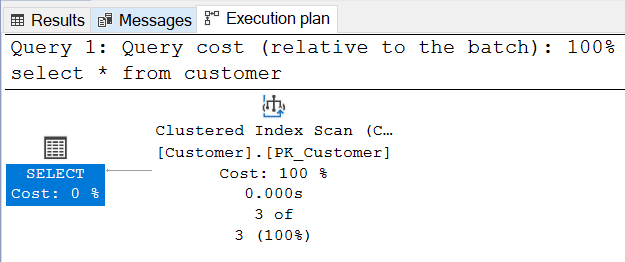
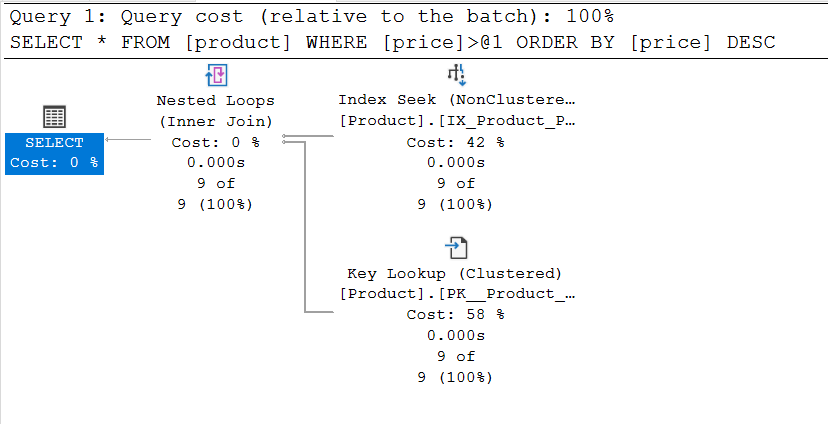

# Lekérdezés optimalizálás labor / Query optimization laboratory

## Feladat 1

A kiadott parancsok:

- **a)** `select * from customer`
- **b)** `select * from customer where id = 1`
- **c)** `select * from customer where id <> 1`
- **d)** `select * from customer where id > 1`
- **e)** `select * from customer where id > 1 order by id desc`

### **a)-d)**

A lekérdezési terv mindegyikre nagyon hasonló, mindegyik _table scan_-t használt:

**Magyarázat:** Az optimalizáló nem tud indexet használni, így minden lekérdezés table scan lesz.

### **e)**

Egyedül ez különbözik, az order by miatt még egy sort is lesz benne.

**Magyarázat:** A table scan marad, és még rendezni is kell, amihez nincs index segítség, tehát külön lépés lesz.

## Feladat 2

A kiadott parancsok:

- A kiadott parancsok megegyeznek az első feladat kiadott parancsaival.

### **a)**

**Magyarázat:** Clustered Index Scan végigmegy a clustered index mentén. Az elsődleges kulcs hatására létrejött egy Clustered Index, azaz innentől a tábla rekordjai ID szerinti sorrendben vannak tárolva. Ha végigmegyünk ezen a struktúrán meglesz az összes sor. Ha van clustered index, már nem fogunk Table Scan-nel találkozni, legrosszabb esetben teljes Clustered Index Scan lesz. Attól, hogy nem Table Scan a neve, a teljes Clustered Index Scan is valójában egy table scan, a teljes tábla adattartalmát felolvassuk. Általános esetben ez probléma, de itt épp ezt kértük a lekérdezésben.

### **b)**

**Magyarázat:** Ez egy Clustered Index Seek lesz. Mivel a rendezési kulcsra fogalmazunk meg egyezési feltételt, a rendezett tárolású rekordok közül nagyon gyorsan eljuthatunk a keresetthez. Ez egy jó terv, a Clustered Index egyik alapfeladata a rekord gyors megtalálása, erre van optimalizálva.

### **c)**

**Magyarázat:** Az előzőhöz nagyon hasonló a terv: ez is Clustered Index Seek lesz két intervallummal (< konstans, > konstans). Az optimalizáló két intervallumra bontja a <>-t. Mivel a feltétel a rendezési kulcsra vonatkozik, megint ki tudja használni a Clustered Indexet. Ez is egy jó terv, a rendezés miatt csak a szükséges rekordokat fogjuk felolvasni. 

### **d)**

**Magyarázat:** Ez is Clustered Index Seek alapú range scan lesz egy intervallummal. Az előbbihez nagyon hasonló.

### **e)**

**Magyarázat:** Ismét Clustered Index Seek backward seek order-rel. Megnézhetjük a Properties ablakban a range-et és a Seek Order-t: kikeressük a határon lévő rekordot és onnan visszafelé indulunk el, így eleve rendezve lesz az eredményhalmaz. Ez egy jó terv, a rendezés miatt csak a szükséges rekordokat fogjuk felolvasni és pont a megfelelő sorrendben.

## Feladat 3

A kiadott parancsok:

- **f)** `select * from product`
- **g)** `select * from product where price = 800`
- **h)** `select * from product where price <> 800`
- **i)** `select * from product where price > 800`
- **j)** `select * from product where price > 800 order by price desc`

### **f)-i)**

**Magyarázat:** Clustered Index Scan végigmegy a clustered index mentén. Ez továbbra is a teljes tábla felolvasása, hiszen a szűrésre nincs index. Ha van szűrési feltétel, minden soron végig kell menni és ki kell értékelni a feltételt. Mivel van Clusterd Index, így amentén haladunk, de nem sokra megyünk ezzel, lényegében egy Table Scan. Ezek nem hatékony lekérdezések. Mivel nem a Clustered Index rendezési kulcsra fogalmaztuk meg a feltételt, így az index nem sokat segít nekünk (ezért lesz Scan és nem Seek).

### **j)**

**Magyarázat:** Ez is Clustered Index Scan lesz, de ami az érdekes, hogy a rendezés költsége jelentős (nagyobb mint a kikeresésé). Miután az elég költséges Index Scan-t megcsináltuk, még rendeznünk is kell, hiszen a kiolvasott rekordok ID szerint sorrendezettek nem Price szerint. Ez a lekérdezés nagyon költséges, az amúgy is drága scan után még rendezni is kell. A jó index nem csak a keresést segíti - de most nincs megfelelő indexünk.

## Feladat 4

A kiadott parancsok:

- A kiadott parancsok megegyeznek a harmadik feladat kiadott parancsaival.

### **f)**

**Magyarázat:** Hiába az új index, ez még mindíg Index Scan lesz - hiszen a teljes tábla tartalmát kértük.

### **g)-i)**

**Magyarázat:** Clustered Index Scan lesz, lényegében megegyezik a szűréshez elvileg használható index nélküli esettel.

Miért nem használja az új indexünket? A nem túl nyilvánvaló ok a projekcióban rejlik, azaz, hogy teljes rekordokat kérünk vissza. Az NonClustered Index-ből csak egy halom rekordreferenciát kapnánk, amik alapján még utána fel kellene olvasni a szükséges rekordokat. Az optimalizáló – főleg kis táblák esetén- dönthet úgy, hogy ennek összköltsége nagyobb lenne, mint egy index scan-nek.

### **j)**

**Magyarázat:** A NonClustered Index Seek-ből kikeresett megfelelő kulcsoknak megfelelő rekordokat kikeressük a Clustered Index-ből. Lényegében egy join a két index között.

A többi lekérdezésnél is valami ilyet vártunk volna. A Clustered Index-re szükség van, mert teljes rekordokat kérünk vissza, a NonClustered Index csak referenciákat ad. A referenciák sorrendben vannak, így ha ezekhez rendre kigyűjtjük a teljes rekordokat a Clustered Index-ből akkor megspóroljuk az utólagos rendezést. Ha csak a Clustered Index-et használnánk (teljes Clustered Index Scan), akkor kellene utólagos rendezés. Ez egy elfogadható terv, mert a NonClustered Index segítségével megúsztuk a külön rendezést.

## Feladat 5

A kiadott parancsok:

- A kiadott parancsok megegyeznek a harmadik feladat kiadott parancsaival.

### **f)**

**Magyarázat:** Megegyezik a negyedik feladattal.

### **g)**

**Magyarázat:** A NonClustered Index Seek-ből kikeresett kulcsoknak megfelelő rekordokat kikeressük a Clustered Index-ből. Lényegében egy join a két index között.

Vessük össze az előző, kis táblás változattal. Miért nem használja most a Clustered Index Scan-t? Nagy tábláknál megnő a szelektivitás szerepe és jelentős a NonClustered Index használatából fakadó előny. A Clustered Index Scan nagy méretnél nagyon drága, ha van esély rá, hogy az NonClustered Index használatával csökkenthető a felolvasható sorok száma, akkor szinte biztosan érdemes használni. A Price statisztikái alapján tudható, hogy az = operátor jól szűr. Fontos! Az = használatából még nem következik a jó szűrés, ha szinte minden sorban ugyanaz az érték van, akkor pl. nem fog jól szűrni - ezért kell a statisztika is!

Ez a terv elfogadható. Ha a feltételünk jól szűr, akkor tényleg ez lehet a jó irány.

### **h)**

**Magyarázat:** Clustered Index Scan végigmegy a clustered index mentén, megegyezik a korábban látottakkal.

Miért nem használjuk az előző módszert? Ha az = ezen tábla esetében jól szűrt, akkor a <> nem fog. Ha ezt tudja a statisztikák alapján az optimalizáló, akkor összességében nem éri meg trükközni, úgyis fel kell olvasni a teljes táblát.

### **i)**

**Magyarázat:** Attól függ, hogy milyen konstanst választunk. Ha nagyon jól szűr (pl. nagyon nagy szám a konstans), akkor a g)-nél, ha nem akkor a h)-nál látott módszert követi.

### **j)**

**Magyarázat:** Mint a g) esetében. Számít itt az order by desc? Az optimalizáló megpróbálja elkerülni a rendezést, azt pedig csak ezzel a módszerrel tudja. Ez egy elfogadható terv. Az NonClustered Index segítségével itt is megúsztuk a rendezést.

## Feladat 6

A kiadott parancsok:

- A kiadott parancsok megegyeznek a harmadik feladat kiadott parancsaival. Azzal a különbséggel, hogy az egész sor lekérdezése helyett (`select *`) csak a Price és az elsődleges kulcs értékét kell lekérdezni (`select Price, ID`).

### **f)**

**Magyarázat:** NonClustered Index Scan használatával működik. A 4) feladatban létrehozott indexet használja. Itta 4) feladat f) részével ellentétben nem az egész sort kérdezzük le, így már használhatja az alkotott indexet.

### **g)**

**Magyarázat:** Itt is NonClustered Index Scan-t használ. Ugyanazon okból, amiért a feladat f) részében. És az akülönbség a 4.g) feladathoz képest, hogy it csak adott oszlopokat kérdez le, amikhez használható az index.

### **h)**

**Magyarázat:** Az index miatt tud NonClustered Index Scannel a Price értékre szűrni, amit utána egy Inner Joinnal hozzákapcsola többi oszlophoz. Itt is azért használhatja a NonClustered Index Scant mert, csak a Price és elsődleges kulcs oszlopok a szűrés eredményei.

### **i)**

**Magyarázat:** A feladat f) részével hasonlatos okokból.

### **j)**

**Magyarázat:** A feladat i) részével hasonlatos. A rendezésre nincsen szükség, csupán visszafele kell venni a rekordokat, mert már alapból rendezett.

## Feladat 7

A kiadott parancsok:

- **j)** `select * from Product where ID between 5 and 10 `
- **k)** `select * from Product where (ID between 5 and 10) Or (ID not between 10 and 100)`

### **j)**

**Magyarázat:** A lekérdezés a 3. feladat f-i részéhez hasonlóan Clustered Index Scant használ. Mivel az összes oszlop lekérdezésre kerül és így nem tudja használni az indexet.

### **k)**

**Magyarázat:** A j részhez hasonló. Csak itt a szürés feltétele sokkal több rekordra teljesül.

## Feladat 8

A kiadott parancsok:

- **m)** `select ID from product where cast(Price as int) = 10`
- **n)** `select ID from product where Price BETWEEN 10-0.0001 AND 10+0.0001`

### **j)**

**Magyarázat:** Itt NonClustered Index Seek-et használ a Scannal szemben. Ezután még használ egy Inner Join

### **k)**

**Magyarázat:** A j résszel hasonlatos módon Nonclustered Index Seeket használ, de itt nincs szükség az Inner Joinra.

## Feladat 9

A kiadott parancsok:

- **o)** `select * from product where price < 2 order by ID desc`
- **p)** `select ID, Price from product where price < 2 order by ID desc`
- **q)** `select * from product where price > 2 order by ID desc`
- **r)** `select ID, Price from product where price > 2 order by ID desc`

### **o)**

**Magyarázat:** NonClustered Index Seek és Clustered Key Lookup Inner Join-ja segítségével lehet megkapni a kívánt rekordokat. Ezek után még egy Sort szükséges a rendezéséhez.

### **p)**

**Magyarázat:** Ebben az esetben ez előzőtől eltérően elég a NonClustered Index Seek. Ezek után szükség van még a Sortra. Ez a megalkotott index miatt más mint az o feladatrésznél.

### **q)**

**Magyarázat:** Az o résztől eltérően, itt egy Clustered Index Scan használva történik meg a lekérdezés. Itt nincsen szükség Sortra.

### **r)**

**Magyarázat:** Ez ebben az esetben ugyanaz történik, mint a q lekérdezésben.

## Feladat 10

A kiadott parancsok:

- **s)** `select Name, ID from product where substring(Name, 1, 1) = 'Z'`
- **t)** `select Name, ID from product where Name like 'Z%'`
- **u)** `select Name, ID from product where Name like '%Z%'`
- **v)** `select Name, ID from product where Name = 'Apple'`
- **w)** ``

### **s)**

**Magyarázat:** NonClustered Index Scan segítségével oldja meg a lekérdezést. A selectnek is van költsége.

### **t)**

**Magyarázat:** Itt NonClustered Index Seeket használ és nincsen költsége a selectnek.

### **u)**

**Magyarázat:** Itt NonClustered Index Scant használ, az s részhez hasonlóan, de nincsen költsége a Selectenk.

### **v)**

**Magyarázat:** A t lekérdezéshez hasonlóan NonClustered Index Seeket használ.

### **w)**

**Magyarázat:** Az s lekérdezéshez hasonlóan NonClustered Index Scan segítségével oldja meg a lekérdezést és a selectnek is van költsége.

## Feladat 11

A kiadott parancsok:

- **x)** `select max(ID) from product`
- **y)** `select min(Price) from product`

### **x)**

**Magyarázat:** A lekérdezés Clustered Index Scant használva működik, aminek az eredményét aztán Top segítségével, majd Stream Aggregate használatával véglegesíti.

### **y)**

**Magyarázat:** Annyiban különbözik az x lekérdezéstől, hogy itt NonClustered Index Scant használ. A megalkotott index miatt.

## Feladat 12

A kiadott parancsok:

- `select count(ID) from product group by CategoryID`

**Magyarázat:** Clustered Index Scan, majd Hash Match segtségével határozza meg az eredményt. 

## Feladat 13

A kiadott parancsok:

- Ugyanaz mint a 12. feladatban

**Magyarázat:** Felvettem indexet a CategoryID oszlopra. Emiatt most már a lekérdezés NonClustered Index Scant használt, amivel gyorsabb lett.

## Feladat 14

A kiadott parancsok:

- `select Name from product where CategoryID = 2`

**Magyarázat:** Egy Key Lookup és egy NonClustered Seek Inner Joinja adja meg az eredményt. Nem segített, mert a Name és a CategoryId oszlopokra is van index, de ez a kettő nem áll kapcsolatban egymással.

## Feladat 15

A kiadott parancsok:

- `select Name from product where CategoryID = 2`

**Magyarázat:** Gyorsabb lett a lekérdezés. 
egy NonClustered Index Seek elegendő az elvégzéséhez, mivel létezik közös index a Name és CategoryID oszlopokra.
