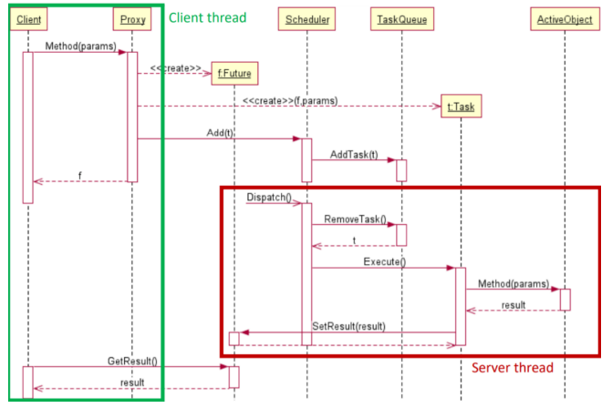
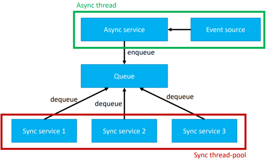
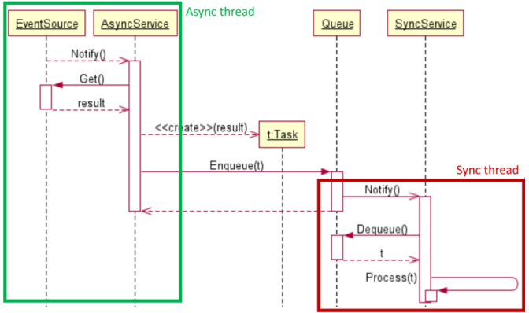
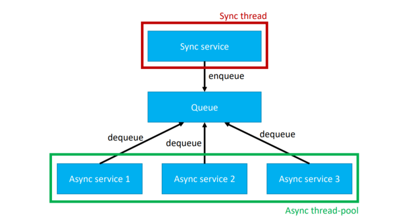
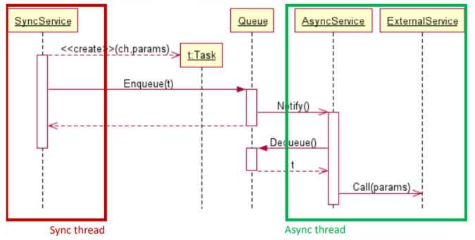
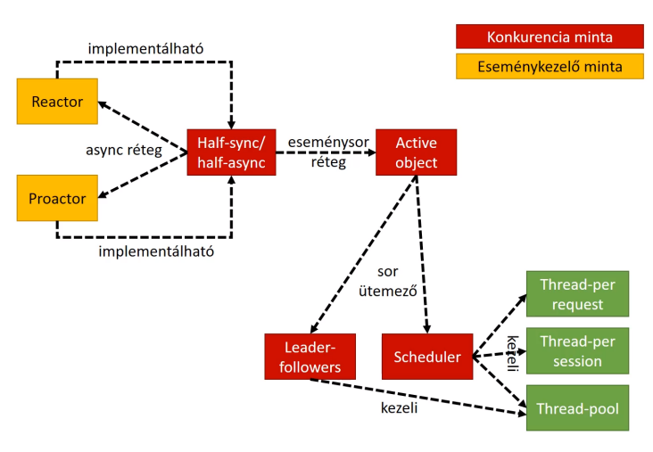

# Konkurens és párhuzamos minták

[Főoldal](oop.md)
<details>
  <summary></summary>

[Fogalmak](terms.md)

[Minták](patterns.md)

[Elvek](principles.md)

[Heurisztikák](heuristics.md)

[Refaktorálás](refactoring.md)

[Clean-code](cleanCode.md)

[API tervezési elvek](APIDesign.md)

[Elosztott objektumorientáltság](distributed.md)

[Immutable objektumorientáltság](immutable.md)

[C++ Idiómák](idioms.md)

</details>

## Tartalom
<details open>
  <summary></summary>

- [Konkurens és párhuzamos minták](#konkurens-és-párhuzamos-minták)
  - [Tartalom](#tartalom)
  - [A konkurencia és az elosztott rendszerek problémái](#a-konkurencia-és-az-elosztott-rendszerek-problémái)
    - [A konkurens programozás előfordulása](#a-konkurens-programozás-előfordulása)
    - [A konkurens programozás problémái](#a-konkurens-programozás-problémái)
    - [Elosztott rendszerek problémái](#elosztott-rendszerek-problémái)
  - [Szinkronizációs minták](#szinkronizációs-minták)
    - [Atomic operations](#atomic-operations)
    - [Scoped locking](#scoped-locking)
    - [Balking design pattern](#balking-design-pattern)
    - [Singleton implementálási probléma](#singleton-implementálási-probléma)
    - [Double-checked locking](#double-checked-locking)
    - [Double-checked locking problémája](#double-checked-locking-problémája)
    - [Double-checked locking elkerülése statikus inicializálással](#double-checked-locking-elkerülése-statikus-inicializálással)
    - [Double-checked locking elkerülése lusta statikus inicializálással](#double-checked-locking-elkerülése-lusta-statikus-inicializálással)
    - [Guarded suspension](#guarded-suspension)
    - [Guarded suspension - FIFO példa](#guarded-suspension---fifo-példa)
    - [Monitor object](#monitor-object)
    - [Semaphore](#semaphore)
    - [Mutex](#mutex)
    - [Manual reset event](#manual-reset-event)
    - [Auto reset event](#auto-reset-event)
    - [Readers-writer lock](#readers-writer-lock)
    - [Strategized locking](#strategized-locking)
    - [Thread-safe interface](#thread-safe-interface)
  - [Kontextus minták](#kontextus-minták)
    - [Globális kontextus](#globális-kontextus)
    - [Thread-local storage](#thread-local-storage)
    - [Thread-local context](#thread-local-context)
  - [Kérés- és eseménykezelési minták](#kérés--és-eseménykezelési-minták)
    - [Asynchronous completion token (ACT)](#asynchronous-completion-token-act)
    - [Cancellation token](#cancellation-token)
    - [Future/Task/Deferred](#futuretaskdeferred)
    - [Proactor](#proactor)
    - [Reactor vs Proactor minta](#reactor-vs-proactor-minta)
  - [Konkurencia minták](#konkurencia-minták)
    - [Active object](#active-object)
    - [Half-sync/half-async](#half-synchalf-async)
    - [Half-sync/half-async - async->sync](#half-synchalf-async---async-sync)
    - [Half-sync/half-async - sync->async](#half-synchalf-async---sync-async)
    - [Leader-followers](#leader-followers)
    - [Scheduler](#scheduler)
  - [Kapcsolat a minták között](#kapcsolat-a-minták-között)

</details>

---

## A konkurencia és az elosztott rendszerek problémái

A konkurens és elosztott minták abban segítenek, hogy ezeket korrekt módon tudjuk megoldani.

<details>
  <summary></summary>


### A konkurens programozás előfordulása

Problémái abból erednek, hogy több szál próbál egy módosítható közös állapothoz egyszerre hozzáférni.

### A konkurens programozás problémái

Konkurens programozás esetben versenyhelyzet van a szálak között, felülírhatják egymás értékeit, így valamilyen módon szinkronizálni kell közöttük. Vigyázni kell, nehogy a szálak dead-lock-ba kerüljenek, és el kell kerülni, hogy egyes szálakat kiéheztessünk. Ezen kívül tovább nehezít, hogy nem lehet pontosan reprodukálni.

### Elosztott rendszerek problémái

Problémát okoz a heterogenitás, vagyis, hogy a szerver és kliens különböző programnyelveken is készülhet. Meg kell oldani a transzparenciát, hogy lehetőleg a kliens ne tudjon róla, hogy éppen
egy lokális, vagy egy távoli objektummal kommunikál. A kérések feldolgozása történhet szinkron és aszinkron módon is. Memória menedzsment problémák is felmerülhetnek, hogy kinek kell lefoglalnia, és kinek kell felszabadítania egy adott objektumot. Felmerülhetnek versenyhelyzetek. Fel készülni, és reagálni kell tudni a hálózati hibákra.

</details>

## Szinkronizációs minták

Szálak közötti szinkronizációra nyújtanak megoldást.

<details>
<summary>Szinkronizációs minták első csoportja: kritikus szakasz</summary>

### Atomic operations
- az atomi operáció processzor szinten is atomi művelet
- kölcsönös kizárás nélkül is működnek

### Scoped locking
- ha nincs olyan processzorutasítás, amely adott műveletek csoportját atomiként tudná elvégezni
- ezeket a műveleteket egy kritikus szakaszban lehet csoportosítani, amely garantálja a szálak közötti kölcsönös kizárást, így ezek a szálak szempontjából atominak tűnnek

</details>

<details>
<summary>Szinkronizációs minták második csoportja: Balking</summary>

### Balking design pattern
- azonnal visszatér, ha az objektum nem a megfelelő állapotban van

### Singleton implementálási probléma
- ha kódban látható naív módon implementálnánk a [Singletont](patterns.md/#singleton), akkor előforulhat, hogy két szál egyszerre vizsgálja meg példámyosítva lett-e már és mind a kettő az látja, hogy a Singleton még nem létezik, így mind a kettő létrehoz egy-egy példát a Singleton-ból

### Double-checked locking
- először megvizsgáljuk, hogy a singleton létezik-e már, és ha igen, akkor visszatérünk vele
- ha nem akkor egy kritikus szakasz segítségével hozzuk létre

### Double-checked locking problémája
- amikor létrehozza a singletont, előbb állítja be a singleton változó értékét az objektumra mutató refernciára, a konstruktor pedig csak ezután fog lefutni. Ezzel az a baj, hogy amíg a konstuktor fut, egy másik szál is jöhet, és elkérheti singletont és azt fogja látni, hogy a változónak már van értéke, így visszatér és a szál egy félkész objektummal fog találkozni

### Double-checked locking elkerülése statikus inicializálással
- garantáltan atomi művelet, hátránya az, hogy nem lusta inicializálásról van szó

### Double-checked locking elkerülése lusta statikus inicializálással
- a singletont egy belső osztályban hozzunk létre

### Guarded suspension
- megvárja, míg sikerül belépni a kritikus szakaszba és egyben egy elvárt előfeltétel is teljesül

### Guarded suspension - FIFO példa
```
public class Fifo<T> {
  private Object lock = new Object();
  private ArrayList<T> items = new ArrayList<>();

  public void enqueue(T item) {
    synchronized (lock) {
      while (items.size() > 10) {
        try { lock.wait(); }
        catch (InterruptedException e) {}
      }
      items.add(item);
      lock.notifyAll();
    }
  }

  public T dequeue() {
    T result;
    synchronized (lock) {
      while (items.size() == 0) {
        try { lock.wait(); }
        catch (InterruptedException e) {}
      }
      result = items.get(0);
      items.remove(0);
      lock.notifyAll();
    }
    return result;
  }
//...
}
```


</details>

<details>
<summary>Szinkronizációs minták harmadik csoportja: Jelzések </summary>

### Monitor object
- biztosítja a kölcsönös kizárást és a szálak közti jelzéseket
- egy szál futása felfüggeszthető, és a jelzés arra szolgál, hogy ezt a szálat fel tudjuk ébreszteni
- [Példa kód](ParalellPatternCodes/monitor.cpp)

### Semaphore
- egy számláló, ami a szabad szálak számát jelzi

### Mutex
- a Mutex (Mutual exclusion) jelentése kölcsönös kizárás
- egyetlen erőforráshoz való hozzáférés szabályozható
- mint egy olyan Semaphore, amelynek számlálója 1 értékű

### Manual reset event
- engedélyezi több szál futását, miután egy művelet eredménye elkészült
- a szálak ennek az eredményére várnak
- a jelzésnek két állapota van: vagy jelez, vagy nem jelez
- jelző állapotban a szálak tovább futhatnak, nem jelző állapotban blokkolva várakoznak
- a két állapot között manuálisan, explicit függvényhívásokkal kell váltani

### Auto reset event
- hasonló a manual reset event-hez, egyetlen különbség, hogy a waitOne() függvény sikeres lefutásának hatására a jelző automatikusan visszaesik nem jelzett állapotba

### Readers-writer lock
- egyetlen erőforráshoz lehet hozzáférést biztosítani, úgy, hogy az erőforrást egyszerre többen is tudják olvasni, de egyszerre csak egyvalaki tudja írni, és amíg az írás folyamatban van, addig olvasni sem lehet

</details>

<details>
<summary>Szinkronizációs minták negyedik csoportja: Publikus intefész </summary>

### Strategized locking
- célja, hogy az alkalmazás egyszálú és többszálú működésben is hatékony legyen
- az előbb tanult jelzéseket a [Strategy](patterns.md/#strategy) tervezési minta segítségével dinamikusan cserélhetővé tesszük, és implementálunk belőlük egy nullobject változatot is, amely a többszálú rézeket üres műveletként implementálja

### Thread-safe interface
- egyes programnyelvekben és könyvtárakban hogyha a jelzéseket rosszul használjuk, akkor a rekurzív függvényhívások deadlock-hoz vezethetnek
- zárolást csak az osztályok publikus függvényei végezhetnek, amelyek aztán tovább hívnak a belső protected illetve privát függvényekhez, és ezek abelső függvények már nem végeznek több szálkezelő műveletet, így működhetnek rekurzívan


</details>


## Kontextus minták

<details>
  <summary></summary>

### Globális kontextus
- a programkód bármely pontján elérhető legyen globális információ anélkül, hogy azt folyamatosan paraméterként kelljen átadni
- főleg egyszálú alkalmazásoknál használható

### Thread-local storage
- a globális kontextus többszálú felhasználásához szükséges egy olyan tár, amely szálanként eltérő információt tud biztosítani

### Thread-local context
- hasonló, mint a globális kontextus, csak a scope-ok és a contextus-ok is szálanként egyediek

</details>

## Kérés- és eseménykezelési minták

<details>
  <summary></summary>

### Asynchronous completion token (ACT)
- ha a kliens több aszinkron hívást intéz a szerverhez, majd megkapja azokra az aszinkron válaszokat, akkor nehéz eldönteni, hogy melyik kérésre melyik válasz érkezett
- a megoldás, hogy a kliens minden egyes kérésbe belerak egy azonosítót, ez az asynchronous completion token, amelyet a szerver az egyes válaszokkal együtt visszaküld

### Cancellation token
- legyen lehetőség megszakítani a háttérművelet végrehajtását
- átadjuk neki paraméterként a cancellation token-t, és a szerver a művelet végrehajtása közben
időnként ránéz erre, hogy kezdeményezték-e már a művelet végrehajtásának visszavonását

### Future/Task/Deferred
- a kliens szinkron elindít a háttérben egy hosszú számítást, majd előbb-utóbb értesülni szeretne annak eredményéről
- a future vagy task objektumot az aszinkron művelet adja vissza eredményként, ez az aszinkron művelet végrehajtásáról egy csak olvasható képet ad
- le lehet tőle kérdezni, hogy fut-e még művelet, végzett-e már, vagy esetleg valaki visszavonta-e

Reactor
- nem blokkoló, szinkron eseményfeldolgozást tesz lehetővé
- az események kívülről aszinkron módon érkeznek, vagyis a kliens nem blokkolódik
- az esemény feldolgozása egy szálon történik

### Proactor
- a háttérben aszinkron módon, hosszú lefutású műveleteket kezdeményezünk, majd, amikor egy művelet végzett, az egy eseményt generál, a Proactor pedig ezekre az eseményekre fog reagálni

### Reactor vs Proactor minta
- a különbség az, hogy a Reactorban az alkalmazás passzív, arra vár, hogy kívülről eseményeket kapjon, míg a Proactornál az alkalmazás aktív, ő kezdeményezi a hosszú lefutási idejű műveleteket a háttérben, és arra reagál, hogyha a művelet eredményének elkészülte eseményt
generál

</details>

## Konkurencia minták

A konkurencia minták a többszálú feldolgozásról szólnak.

<details>
  <summary></summary>

### Active object
- célja a függvény meghívásának és a függvény lefutásának szétcsatolása
- a kliens és a szerver külön szálon futnak
- amikor a kliens a Proxy objektumot meghívja, a Proxy létrehozza a Future-t, ami később az eredményt szolgáltatja a kliensnek, és létrehoz egy Task-ot, ami később a háttérben a függvény végrehajtásáért fog felelni

<p align="center">
    
</p>

### Half-sync/half-async
- a szinkron és az aszinkron végrehajtást szétcsatolja egymástól
- a szétcsatolás egy task-okat tartalmazó soron keresztül történik

### Half-sync/half-async - async->sync
- egy aszinkron kliens hív szinkron szervert
- aszinkron módon érkeznek feladatok, és szinkron módon dolgozzuk őket fel
- szerver objektumokból több is lehet, ezek külön szálakon futnak
<p align="center">
    
</p>
- működése:
  <p align="center">
    
</p>

### Half-sync/half-async - sync->async
- egy szinkron kliens hív aszinkron szervert
- egy darab szinkron szál generálja a feladatokat, berakja őket egy feladatsorba, és az aszinkron feldolgozók ezekből válogatnak
<p align="center">
    
</p>
- működése:
<p align="center">
    
</p>

### Leader-followers
- egy nagyon egyszerű ütemezést valósít meg
- van egy készletünk a szálakból, amelyek közül egy a Leader, a többiek a followers
- a follower szálak arra várnak, hogy egyszer majd leader-ek lehessenek
- sorra érkeznek a feladatok, és mindig a vezető szál kapja a következőt
- ilyenkor a vezető szál a követő szálak közül egyet előléptet vezetővé, ő pedig elkezd dolgozni a feladaton, és amikor végzett, ő is követővé válik

### Scheduler
- okos ütemezést valósít meg
- folyamatosan érkeznek be a feladatok
- az ütemező több szálat kezel egyszerre és algoritmus alapján ezeknek osztja ki a feladatokat

</details>


## Kapcsolat a minták között

<p align="center">
    
</p>
