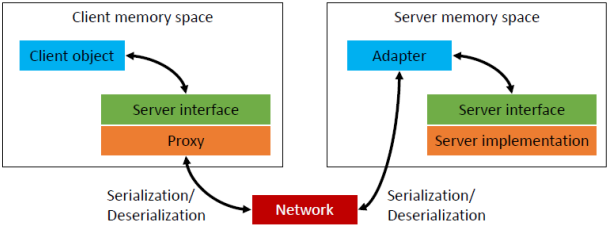
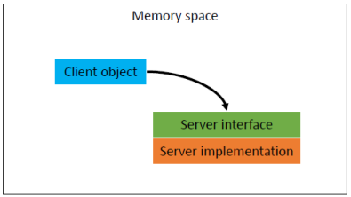

# Elosztott objektumorientáltság

[Főoldal](oop.md)

  

[Fogalmak](terms.md)

[Minták](patterns.md)

[Elvek](principles.md)

[Heurisztikák](heuristics.md)

[Refaktorálás](refactoring.md)

[Clean-code](cleanCode.md)

[API tervezési elvek](APIDesign.md)

[Konkurens és párhuzamos minták](concurrentParalell.md)

[Immutable objektumorientáltság](immutable.md)

[C++ Idiómák](idioms.md)

## Tartalom

  

- [Elosztott objektumorientáltság](#elosztott-objektumorientáltság)
  - [Tartalom](#tartalom)
  - [Elosztott OO](#elosztott-oo)
    - [Helyi hívás](#helyi-hívás)
    - [Távoli hívás](#távoli-hívás)
  - [Felmerülő kérdések](#felmerülő-kérdések)
    - [Hogyan definiáljuk a szerver interfészét, ha …](#hogyan-definiáljuk-a-szerver-interfészét-ha-)
  - [Technológiák elosztott kommunikáció megvalósításához](#technológiák-elosztott-kommunikáció-megvalósításához)
  - [SOAP webszolgáltatások](#soap-webszolgáltatások)
  - [REST szolgáltatások](#rest-szolgáltatások)

---

## Elosztott OO 

Azt vizsgáljuk, hogy ha a hívó, vagyis a kliens objektum és a hívott, vagyis a szerver objektum hálózati kapcsolaton kommunikál egymással, akkor ennek során milyen problémák léphetnek fel, és milyen megoldásokat adhatunk ezekre a problémákra.

  

### Helyi hívás

- a kliens és a szerver ugyanabban a memóriatérben vannak
- a kliens objektumnak közvetlen mutatója van a szerver objektumra
- a hívás közvetlenül megtörténhet
- a kliens a meghívja a szerver függvényét, eredménye közvetlenül visszakerül a klienshez

    

### Távoli hívás

- a kliens objektum és a szerver objektum külön memóriatérben vannak
- a kliensnek nincsen közvetlen mutatója a szerver objektumra, a két objektum hálózati kapcsolaton keresztül kommunikál
- a kliens ne tudja, hogy távoli objektummal kommunikál, ugyanolyan interfészt kell látnia,  mintha helyi lenne
- ezt az interfészt egy Proxy objektum implementálja és a kliens hívását hálózati üzenetté konvertálja (ezt a konverziót nevezzük sorosításnak)
- a hálózati üzenetet a szervet oldalon egy adapter fogadja és továbbítja a szerver objektumnak
- a visszatérési értéket az adapter sorosítja, és a hálózaton keresztül visszaküldi a Proxynak
- a Proxy visszasorosítja az üzenetet és visszaadja azt a kliensnek

    

Problémák:
- meg kell találni a szervert
- az adapternek lehet, hogy egyszerre több kérést ki kell szolgálnia -> többszálúság
- sorosítás ha különböző nyelven van a szerver és kliens

## Felmerülő kérdések

  

### Hogyan definiáljuk a szerver interfészét, ha …
- ugyanaz a programnyelv?
    nincs gond 
- különböző a programnyelv?
    programnyelvektől független interfész leíróra van szükség

## Technológiák elosztott kommunikáció megvalósításához

  

## SOAP webszolgáltatások

A SOAP egy XML-re épülő programnyelvektől és operációs rendszerektől független kommunikációs szabvány. Széles körben elterjedt, és jól támogatott megoldás, .NET-ben és Java-ban is egy  kényelmes típusos API tartozik hozzá.

  

## REST szolgáltatások

  

