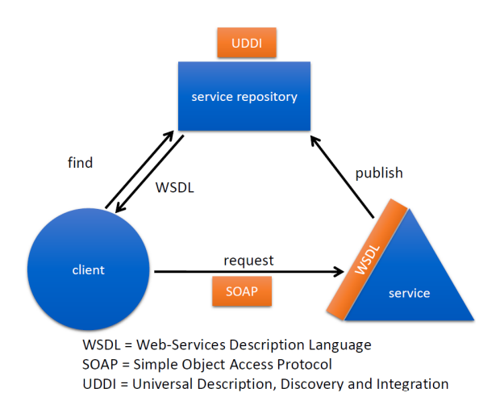
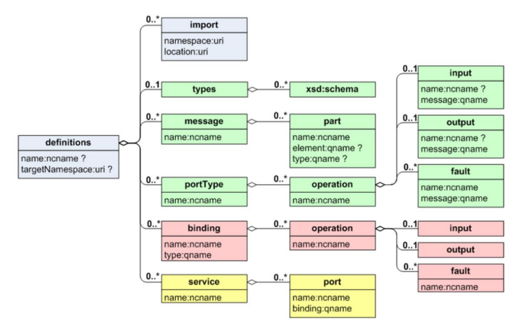

# Elosztott objektumorientáltság

[Főoldal](oop.md)
<details>
  <summary></summary>

[Fogalmak](terms.md)

[Minták](patterns.md)

[Elvek](principles.md)

[Heurisztikák](heuristics.md)

[Refaktorálás](refactoring.md)

[Clean-code](cleanCode.md)

[API tervezési elvek](APIDesign.md)

[Konkurens és párhuzamos minták](concurrentParalell.md)

[Immutable objektumorientáltság](immutable.md)

[C++ Idiómák](idioms.md)

</details>

## Tartalom
<details open>
  <summary></summary>

- [Elosztott objektumorientáltság](#elosztott-objektumorientáltság)
  - [Tartalom](#tartalom)
  - [Elosztott OO](#elosztott-oo)
    - [Helyi hívás](#helyi-hívás)
    - [Távoli hívás](#távoli-hívás)
  - [Felmerülő kérdések](#felmerülő-kérdések)
    - [Hogyan definiáljuk a szerver interfészét, ha …](#hogyan-definiáljuk-a-szerver-interfészét-ha-)
    - [A kliens hogyan találja meg a szervert, ha …](#a-kliens-hogyan-találja-meg-a-szervert-ha-)
    - [Hogyan implementáljuk a proxy-t?](#hogyan-implementáljuk-a-proxy-t)
    - [Hogyan sorosítsuk az adatokat?](#hogyan-sorosítsuk-az-adatokat)
    - [Bináris sorosítás](#bináris-sorosítás)
    - [Szöveges sorosítás](#szöveges-sorosítás)
    - [Hogyan kezeljük a memóriát?](#hogyan-kezeljük-a-memóriát)
    - [Hogyan szolgálunk ki több klienst …](#hogyan-szolgálunk-ki-több-klienst-)
    - [Hány objektum példány kell a szerverből?](#hány-objektum-példány-kell-a-szerverből)
    - [Hogyan őrizzük meg az állapotot a hívások között?](#hogyan-őrizzük-meg-az-állapotot-a-hívások-között)
    - [Hogyan kommunikáljunk úgy, ha valamelyik oldal nem elérhető?](#hogyan-kommunikáljunk-úgy-ha-valamelyik-oldal-nem-elérhető)
    - [Hogyan kezeljük a szinkron hívásokat?](#hogyan-kezeljük-a-szinkron-hívásokat)
    - [Hogyan kezeljük az aszinkron hívásokat?](#hogyan-kezeljük-az-aszinkron-hívásokat)
    - [Aszinkron üzenetek: kliens-szerver](#aszinkron-üzenetek-kliens-szerver)
    - [Aszinkron események: publish-subscribe](#aszinkron-események-publish-subscribe)
  - [Technológiák elosztott kommunikáció megvalósításához](#technológiák-elosztott-kommunikáció-megvalósításához)
    - [Konkurens és elosztott minták](#konkurens-és-elosztott-minták)
    - [Sorosítás](#sorosítás)
    - [Objektum-relációs leképezés](#objektum-relációs-leképezés)
    - [Kommunikációs technológia és keretrendszer](#kommunikációs-technológia-és-keretrendszer)
  - [SOAP webszolgáltatások](#soap-webszolgáltatások)
    - [Kommunikáció SOAP webszolgáltatásokkal](#kommunikáció-soap-webszolgáltatásokkal)
    - [SOAP webszolgáltatásokhoz kapcsolódó technológiák](#soap-webszolgáltatásokhoz-kapcsolódó-technológiák)
    - [Példa: SOAP kérés](#példa-soap-kérés)
    - [Példa: SOAP válasz](#példa-soap-válasz)
    - [A WSDL összetétele](#a-wsdl-összetétele)
  - [REST szolgáltatások](#rest-szolgáltatások)
    - [HTTP kérés és válasz](#http-kérés-és-válasz)
    - [REST által használt igék](#rest-által-használt-igék)
    - [A szervernek küldhetünk bemenő paramétert](#a-szervernek-küldhetünk-bemenő-paramétert)

</details>

---

## Elosztott OO 

Azt vizsgáljuk, hogy ha a hívó, vagyis a kliens objektum és a hívott, vagyis a szerver objektum hálózati kapcsolaton kommunikál egymással, akkor ennek során milyen problémák léphetnek fel, és milyen megoldásokat adhatunk ezekre a problémákra.

<details open>
  <summary></summary>

### Helyi hívás

- a kliens és a szerver ugyanabban a memóriatérben vannak
- a kliens objektumnak közvetlen mutatója van a szerver objektumra
- a hívás közvetlenül megtörténhet
- a kliens a meghívja a szerver függvényét, eredménye közvetlenül visszakerül a klienshez

<p align="center">
    
</p>

### Távoli hívás

- a kliens objektum és a szerver objektum külön memóriatérben vannak
- a kliensnek nincsen közvetlen mutatója a szerver objektumra, a két objektum hálózati kapcsolaton keresztül kommunikál
- a kliens ne tudja, hogy távoli objektummal kommunikál, ugyanolyan interfészt kell látnia,  mintha helyi lenne
- ezt az interfészt egy Proxy objektum implementálja és a kliens hívását hálózati üzenetté konvertálja (ezt a konverziót nevezzük sorosításnak)
- a hálózati üzenetet a szervet oldalon egy adapter fogadja és továbbítja a szerver objektumnak
- a visszatérési értéket az adapter sorosítja, és a hálózaton keresztül visszaküldi a Proxynak
- a Proxy visszasorosítja az üzenetet és visszaadja azt a kliensnek


<p align="center">
    
</p>

Problémák:
- meg kell találni a szervert
- az adapternek lehet, hogy egyszerre több kérést ki kell szolgálnia -> többszálúság
- sorosítás ha különböző nyelven van a szerver és kliens


</details>


## Felmerülő kérdések

<details open>
  <summary></summary>

### Hogyan definiáljuk a szerver interfészét, ha …
- ugyanaz a programnyelv?
  
      nincs gond 
- különböző a programnyelv?
 
      programnyelvektől független interfész leíróra van szükség

### A kliens hogyan találja meg a szervert, ha …
- a kliens tudja, hol van a szerver?

      a kliens tárolja a szerver címét
- a kliens csak egy logikai nevet ismer a szerverből?
  
      kell fordítani fizikai címmé, ezt egy naming service végzi
- a kliens csak egy interfészt ismer?
  
      olyan szervert keres, amely ezt az interfészt implementálja. Trading service az, amely egy interfész specifikációt fizikai címmé képez le

### Hogyan implementáljuk a proxy-t? 
- proxy feladatai:
  - szerver megkeresése
  - kapcsolat felépítése
  - input paraméterek és a visszaérkező eredmény sorosítása
- [Proxy](patterns.md/#proxy) vagy [Adapter](patterns.md/#adapter) minta

### Hogyan sorosítsuk az adatokat?
A keretrendszer elvégzi (pl json vagy xml).

### Bináris sorosítás
Gyors és hatékony, kliens és a szerver között bináris kompatibilitást feltételez. Akkor használjuk, ha a kliens és a szerver ugyanazon a programnyelven készült

### Szöveges sorosítás
Emberileg is olvashatók(XML, JSON). Lassú és nem túl hatékony, de jó kompatibilitást biztosít  programnyelvek között és időtálló

### Hogyan kezeljük a memóriát?
Ha van akkor a Garbage Collector. Egyébként:
- kliens oldalon a bemenő paramétereket tipikusan a kliens foglalja, és ő is szabadítja fel. Az eredmény objektumot a proxy foglalja le és a kliensnek kell felszabadítania
- szerver oldalon az adapter foglalja le a memóriaterületet. Az eredményt a szerver oldal foglalja és adapternek kell felszabadítania

### Hogyan szolgálunk ki több klienst …
- egy szálú szerver esetén?
  
      az egy szálú szervernek az a legnagyobb előnye, hogy nem léphetnek fel konkurencia problémák, így nem is kell bonyolult többszálúsággal és konkurenciával foglalkozni. Lehet blokkoló vagyis a kéréseknek várakoznia. Lehet nem blokkoló, ami callback függvényt használ
- többszálú szerver esetén?

      Lehet, hogy minden kliens önálló szálat kap. Vagy a másik megoldás a Thread pool, ilyenkor a szervernek van egy fix készlete a kiszolgáló szálakból


### Hány objektum példány kell a szerverből?
- egy

      minden klienskérést ez szolgál ki
- kliensenként egy
  
      kliensspecifikus állapotot is tud tárolni
- Object pool
  
      ezekhez rendeljük hozzá a beérkező kéréseket, kliens specifikus állapot nem tárolható hozzájuk a szerver memóriájában

### Hogyan őrizzük meg az állapotot a hívások között?
- szerver memóriájában
  
      minden kliens saját szerverobjektummal rendelkezik
- minden hívásban átküldjük
  
      elküldi a teljes állapotot a hívással együtt
- adatbázisban
  
      kliensnek azonosítani kell tudnia magát, hogy a szerver tudja, információ kell


### Hogyan kommunikáljunk úgy, ha valamelyik oldal nem elérhető?
- Szinkron hívások esetén nem tudunk kommunikálni. Aszinkron esetben ha van egy köztes szereplő, aki tudja tárolni a kéréseket, akkor megoldható a szétcsatolt kommunikáció

### Hogyan kezeljük a szinkron hívásokat?
Egy folyamatosan fennálló kapcsolatra van szükség. A kliens elküldi ezen keresztül a kérését, majd blokkolva vár a szerver válaszára. A szerver kiszolgálhatja a kérést szinkron és aszinkron módon is

### Hogyan kezeljük az aszinkron hívásokat?
Történhet úgy, mint a szinkron esetben, csak a kliens nem várakozik blokkolva. Egy callback híváson keresztül értesül az eredményről, vagy periodikusan poll-ozza a szervert. Ha van megbízható köztes szereplő, a kliens és a szerver nem ismeri egymást közvetlenül, hanem szétcsatolva, valamilyen üzenetsoron keresztül kommunikálnak

### Aszinkron üzenetek: kliens-szerver
- a kliensek üzeneteket küldenek a köztes szereplő által fenntartott üzenetsorba
- a szerver ebből a sorból veszi ki egyesével az üzeneteket
- a szerverből több példány is futhat, de ezek a példányok általában egyformák, ugyanazt a feladatot végzik, mindössze csak a skálázhatóság miatt van belőlük több példány
- egy üzenetet csak egy szerverpéldány dolgozhat fel

<p align="center">
    
</p>

### Aszinkron események: publish-subscribe
- ez a modell eseményeken alapul, tipikusan egy termelőnk van, ami eseményeket generál
- ezeket a köztes, megbízható fél egy topic-ban gyűjti, és a fogadók feliratkozhatnak a topic-ban érkező eseményekre
- itt minden eseményt, minden feliratkozó megkap

<p align="center">
    
</p>

</details>

## Technológiák elosztott kommunikáció megvalósításához

<details open>
  <summary></summary>


### Konkurens és elosztott minták
Többszálú szerver megvalósításához kapcsolódik. Biztosítani kell a szálak közötti szinkronizációt, a kölcsönös kizárást, és le kell tudni kezelni a kéréseket.

[Bővebben lásd.](concurrentParalell.md)

### Sorosítás

Bináris sorosítás:  hagyományos objektum sorosítással lehet megoldani

Szöveges sorosítás: XML vagy JSON formátumra konvertálás

### Objektum-relációs leképezés

Szerveroldali adat tárlására adatbázis használható, objektumorientált esetben ezekhez objektum-relációs leképezéssel férhetünk hozzá.

### Kommunikációs technológia és keretrendszer

A kommunikációs technológia megvalósítására több lehetőség kínálkozik. Ha a kliens és a szerver ugyanolyan keretrendszerrel készül. Vagy ha eltérő, akkor célszerű valamilyen programnyelvektől független technológiát használni.


</details>

## SOAP webszolgáltatások

A SOAP egy XML-re épülő programnyelvektől és operációs rendszerektől független kommunikációs szabvány. Széles körben elterjedt, és jól támogatott megoldás, .NET-ben és Java-ban is egy  kényelmes típusos API tartozik hozzá.

<details open>
  <summary></summary>


### Kommunikáció SOAP webszolgáltatásokkal

A SOAP szabvány a legalsó, hálózati réteget definiálja. A szabvány mindössze annyit mond meg, hogy milyen formátumú XML fájlokat kell egymással cserélgetni. Az XML előállítása és feldolgozása az adott programnyelv és keretrendszerr hárul.

A szabványos interfész leíró az XML formátumú WSDL, amely leképezhető a hagyományos programnyelvi interfészekre

### SOAP webszolgáltatásokhoz kapcsolódó technológiák

<p align="center">
    
</p>

- a szolgáltatás a WSDL interfész leíróban adja meg azt, hogy rajta milyen függvények, milyen paraméterekkel hívhatók
- a WSDL-t lehet publikálni, ha a kliens megtalálta a számára megfelelő interfész leírót, akkor tudja használni.


### Példa: SOAP kérés

IHelloWorld interfész, SayHello függvénnyel, egy string típusú name paramétert vár, és string eredménnyel tér vissza:

```
interface IHelloWorld
{
  string SayHello(string name);
}
```
egy üzenet:
```
<s:Envelope xmlns:s="http://schemas.xmlsoap.org/soap/envelope/">
  <s:Body>
    <SayHello xmlns= "http://www.iit.bme.hu/soi">
      <name>me</name>
    </SayHello>
  </s:Body>
</s:Envelope>
```

### Példa: SOAP válasz

Az előbbivel azonos interace-szel.

egy válasz üzenet:
```
<s:Envelope xmlns:s="http://schemas.xmlsoap.org/soap/envelope/">
  <s:Body>
    <SayHelloResponse xmlns="http://www.iit.bme.hu/soi">
      <SayHelloResult>Hi: me</SayHelloResult>
    </SayHelloResponse>
  </s:Body>
</s:Envelope>
```

### A WSDL összetétele

<p align="center">
    
</p>

- a types szekcióban adjuk meg saját összetett típusainkat
- a message-ekben definiáljuk a szolgáltatás által elfogadott és visszaküldött üzeneteket
- a portType definiálja a szolgáltatás interfészét
- a binding konfigurálja a protokollt
- a service tartalmazza a konkrét URL-t, ahol a szolgáltatás meghívható
- használhatjuk az import tag-et, melynek célja az, hogy a WSDL-t fel tudjuk darabolni

[Példa.](https://www.tutorialspoint.com/wsdl/wsdl_example.htm)


</details>

## REST szolgáltatások

A REST (REpresentetional State Transfer) a HTTP protokoll kibővítése. A hálózati kommunikációkért felelős. A magasabb rétegek megvalósításáért a keretrendszerek felelnek.

Bármely alkalmazás tud REST-en keresztül kommunikálni, hogyha képes HTTP protokoll kezelésére. OpenAPI használható REST szolgáltatások interfészének leírására.

<details open>
  <summary></summary>

### HTTP kérés és válasz

Ha egy böngészőbe beírunk egy címét, akkor a böngésző a domain név alapján feloldja a szerver IP címét. Ennek az IP címnek a 80-as portjára nyit egy TCP kapcsolatot, ezen keresztül szövegesen elküldi a HTTP kérést.


A HTTP kérés első sorában szerepel egy ige (pl. GET). Ezt követi az URL lokális része, amely a szerveren belül azonosítja a weboldalt. Az első sort a használni kívánt HTTP protokoll verziója zárja. A következő néhány sorban a HTTP fejrészek következnek. Ezek név-érték párok, melyeket kettőspont választ el egymástól. Majd egy üres sor után jön a kérés törzse.

A szerver egy HTTP üzenetet küld vissza, verzióval, státuszkóddal és annak szöveges megfogalmazásával. Ezután a HTTP fejlécek következnek, amelyeket egy üres sor zár. Utána a válasz törzse következik, ebben szerepel a válasz tartalma (ha van), a Content-Type adja meg a formátumát.

### REST által használt igék

- a GET keresés, illetve lekérdezés
- a POST erőforrás létrehozása
- a PUT erőforrás frissítése
- a DELETE erőforrás törlése
  
### A szervernek küldhetünk bemenő paramétert
- lehetnek az URL / jel közötti részei
- küldhető a query string-ben
- küldhető POST paraméterként
- küldhető bármilyen információ bármilyen formátumban a HTTP törzsben, általában JSON vagy XML formátumban
- amikor a szerver válaszol, az eredmény tipikusan a HTTP törzsben kapjuk meg

</details>