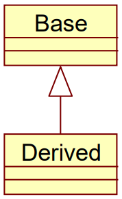
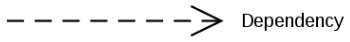
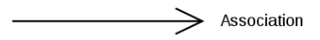
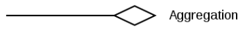
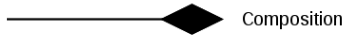
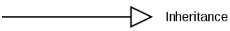
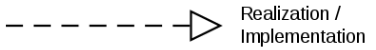
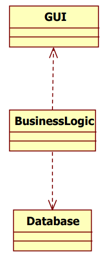
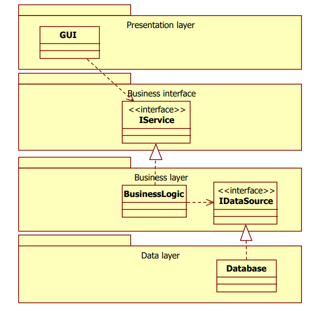

# OOP

A BME VIK Mérnökinformatikus BSc képzésének objektum orientált szoftverfejlesztés tárgyának jegyzete, záróvizsgához.

## Tartalom

  

- [OOP](#oop)
  - [Tartalom](#tartalom)
  - [Kérdések](#kérdések)
  - [Alapfogalmak <a name="alapfogalmak" />](#alapfogalmak-a-namealapfogalmak-)
  - [Kapcsolatok <a name="kapcsolatok" />](#kapcsolatok-a-namekapcsolatok-)
  - [Tervezési elvek <a name="tervezesi-elvek" />](#tervezési-elvek-a-nametervezesi-elvek-)
    - [SOLID elvek <a name="SOLID-elvek" />](#solid-elvek-a-namesolid-elvek-)
      - [Single Responsibility](#single-responsibility)
      - [Open/Closed Principle](#openclosed-principle)
      - [Liskov Substitution Principle](#liskov-substitution-principle)
      - [Interface Segregation Principle](#interface-segregation-principle)
      - [Dependency Inversion Principle](#dependency-inversion-principle)
    - [Egyéb elvek <a name="egyeb-elvek" />](#egyéb-elvek-a-nameegyeb-elvek-)

---

## Kérdések

  

- Tervezés a követelmények változására tekintettel, OO tervezési elvek. Az egyes elvekre: Milyen problémát old meg az adott elv? Mi a megoldás lényege? Miért baj, ha megsértjük? Mikor lehet megsérteni?
  
        valasz

- OO tervezési heurisztikák. Az egyes heurisztikákra: Milyen problémát old meg az adott heurisztika? Mi a megoldás lényege? Miért baj, ha megsértjük? Mikor lehet megsérteni? Hogyan kapcsolódik a refaktorálási mintákhoz és code-smell-ekhez?
  
- Refaktorálás fogalma, szabályai, előnyei és problémái. Milyen refaktorálási minták és code-smell-ek vannak? Hogyan kapcsolódnak egymáshoz? Hogyan kapcsolódnak az OO tervezési heurisztikákhoz?
  
- Clean-code elvek. Az egyes elvekre: Milyen problémát old meg az adott elv? Mi a megoldás lényege? Miért baj, ha megsértjük? Mikor lehet megsérteni?
  
- API tervezési elvek. Az egyes elvekre: Milyen problémát old meg az adott elv? Mi a megoldás lényege? Miért baj, ha megsértjük? Mikor lehet megsérteni?
  
- Elosztott objektumorientáltság. Milyen problémákat vet fel? Milyen megoldási lehetőségek vannak?
  
- Konkurens és párhuzamos minták. Az egyes mintákra: Milyen problémát old meg az adott minta? Mi a megoldás lényege? Hogyan kapcsolódik más mintákhoz?
  
- Immutable objektumorientáltság. Mik a módosíthatóság problémái? Mik a csak olvasható objektumok előnyei és hátrányai? Hogyan kell implementálni egy csak olvasható objektumot leíró osztályt?

--- 

## Alapfogalmak <a name="alapfogalmak" />

Az alábbi fogalmak vázlatosan vannak definiálva. Alapos ismeretük elengedhetetlen a továbbiakban.

  

__Class__: Típus

__Object__: Példány

__Static__: Típushoz (class-hoz) tartozik (pl.: változó vagy függvény)

__Abstraction__: A kontextusban nem fontos részletek elhagyása, a való világ modellezése

__Classification__:  Közös tulajdonság alapján történő csoportosítás

__Encapsulation__:  Egységbezárás, egy osztály adattagjait nem lehet kívülről elérni, csak az erre a célra készített függvényeken keresztül

__Inheritance__:  Leszármazás, a leszármazott osztály tudja használni őse viselkedését, nem az adatait

    

__Polymorphism__: A hívó felől el van rejtve az objektum típusa, annyi ismert, hogy egy adott osztály leszármazottja

__Visibility__: Láthatóság

__Virtual method__: A virtuális függvények felülírhatóak a leszármazottakban, ezzel módosítva a leszármazottak viselkedését

__Abstract method__: Nem rendelkezik implementációval

__Abstract class__: Olyan osztály amit nem lehet példányosítani. Általában van abstract függvénye

__Interface__: Egy olyan függvényhalmaz amik nincsenek implementálva. Az interface-t megvalósító osztályoknak kell ezeket implementálni. Egyes nyelvekben nincs külön interface, helyette abstract osztályok és függvények (tisztán virtuális függvény) használhatóak

__Interface of a class__: Egy osztály publikus függvényeinek halmaza

__Coupling__: Az összefüggések mértéke. Minél alacsonyabb annál jobb. Az összefüggés azt vonja maga után, hogy ha az egyik rész változik, akkor a másiknak is változnia kell.

__Cohesion__: Annak mértéke, hogy egy adott egységen belül mennyir illenek (logikailag) egymáshoz a részek. Minél magasabb annál jobb

--- 

## Kapcsolatok <a name="kapcsolatok" />

Modulok vagy osztályok között előforduló kapcsolatok.

  

__Dependency__: Két elem függőségét fejezi ki a nyíl irányába (függő felé mutat). Az egyik módosulása maga után vonhatja a másikét

    

__Association__: Gyenge ismeretség a nyíl irányába

    

__Aggregation__: Két objektum élettartalma között fellépő gyenge kapcsolat. Erősebb mint az Association de gyengébb mint a Composition

    

__Composition__: Két objektum élettartalma között fellépő erős kapcsolat. Az egyik megszűnése a másik megsemmisítését vnaj maga után

    

__Generalization/Inheritance__: Leszármazás. Az ős viselkedését örökli a leszármazott

    

__Realization/Implementation__: Megvalósítás

    

---

## Tervezési elvek <a name="tervezesi-elvek" />

Olyan tervezési irányelvek és minták amik betartása könnyebben fentarthatóvá és továbbfejleszthetővét teszik a kódot.

  
Bővebben

A folyamatosan változó követelmények lekövetéséhez remek eszköz. 

Egy rosszul tervezett rendszer:
- Nehzen lehet megváltoztatni, mert egy változtatás sok másik részre van hatással (rigidity)
- A változtatás nem várt részekre hat (fragility)
- Az egyes részeket nehezen lehet önállóan újrahasznosítani (immobility)

Megoldás lehet:
- Függőségek csökkentése
- A függőségek a ritkán változó, stabil részekhez kötődjenek

### SOLID elvek <a name="SOLID-elvek" />

A SOLID öt fontos elvet jelöl, mindegyik betűje egyre utal. Segítenek csökkenteni a függőséget és növelik a kódbázis fenntarthatóságát.

#### Single Responsibility

  

"A class should have only one reason to change"

Minden osztálynak pontosan egy felelőssége (feladata) legyen. Ha több van, azt szét kell osztani.

A szétválasztás több szinten történhet. Implementációs szinten ez két külön álló osztályra bontást jelent. Ha ez nem megoldható, akkor lehet interface szinten végezni a szétválasztást, ekkor a megfelelő interface-eket létre kell hozni, amiket aztán megvalósít az osztályunk.

Nem mindig egyértelmű, hogy egy osztály több okból változhat (több felelőssége van). Fontos elv a YAGNI (You Ain’t Gonna Need It), vagyis, hogy ha valami nem fordul elő, arra nem kell tervezni.

#### Open/Closed Principle

  

"Software entities (classes, modules, functions etc.) should
be open for extension, but closed for modification.
"

Egy entitásnak nyíltnak kell lennie a kiegészítésre, de zártnak a módosításra.

Az entitás viselkedését meg lehessen változtatni, hogy ezzel követni tudja a követelményeket.

A kiegészítés ne vonja maga után a már létező forráskód módosulását.

#### Liskov Substitution Principle

  

"Subtypes must be substitutable for their base types"

A leszármazottakat be kell tudni helyettesíteni az őseik helyére, anélkül, hogy ezt a felhasználó észrevenné.

Leszármazás:
- Ami igaz az ősre, az igaz a leszármazottaira is
- Az őse általánosabb a leszármazottnál
- A leszármazott specifkusabb az ősnél
- Bárhol ahol az ős használható, használható a leszármazott

Megsértése típusellenőrzést vonhat maga után és általában az Open/Closed Principle megsértéséhez is vezet.

__Soha ne használjunk leszármazást adat újrahasznosítási céllal! Használjuk a viselkedés újrahasznosítására!__

Függvény Előfeltételek: 
- Feltételei a függvényhívásnak
- pl.: fügvény paramétereinek értékkészlete

Függvény Utófeltételek:
- A függvényhívás után fennálló feltételek
- pl.: fügvény visszatérésének értékkészlete

Osztály Invariánsok (invariants):
- Kényszerek, amiket az osztálynak minden állapotban be kell tartania
- Az osztály saját metódusaival biztosítja őket

Leszármazott függvény előfeltétele nem lehet erősebb őse előfeltételénél és utófeltétele nem lehet gyengébb őse utófeltételénél! Invariánsok erősíthetőek, de nem gyengíthetőek a leszármazottakban!

"Expect no more, provide no less. / Demand no more, promise no less."

A Liskov elv betartása sokszor nem triviális és átfogóbb vizsgálatokat igényelhet.

#### Interface Segregation Principle

  

"Clients should not be forced to depend on methods they
do not use"

Az interface-eket szét kell osztani többm, kisebb és specifikusabb interface-re, hogy a felhasználó tudja csak azt használni, amire tényleg szüksége van.

Ne merüljön fel függőség olyan részekkel, amikre valójában nincs is szükség.

#### Dependency Inversion Principle

  

"Abstractions should not depend on details. Details should
depend on abstractions."

Magas szintű modulok ne függjenek alacsony szintűektől. Különben az alacsony szintű változások magas szintű változtatásokat igényelnek.

Fordítsuk meg interface-ek segítségével a függőség irányát.

Példa a rossz tervezésre:

    

Az adatbázis vagy a GUI változtatása a logika módosítását vonja maga után. Megoldás:

    

### Egyéb elvek <a name="egyeb-elvek" />

  

---