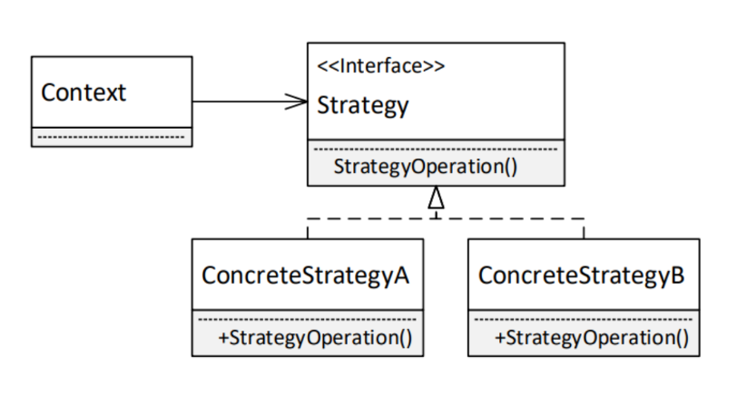
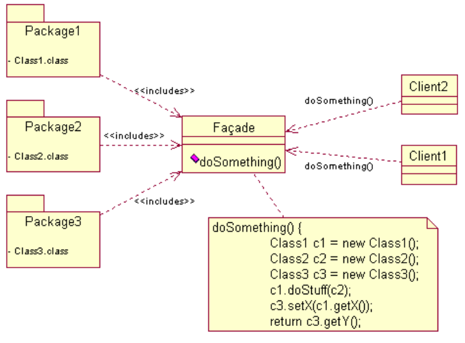

# Tervezési Minták

[Főoldal](oop.md)
<details>
  <summary></summary>

[Fogalmak](terms.md)

[Elvek](principles.md)

[Heurisztikák](heuristics.md)

[Refaktorálás](refactoring.md)

[Clean-code](cleanCode.md)

[API tervezési elvek](APIDesign.md)

[Elosztott objektumorientáltság](distributed.md)

[Konkurens és párhuzamos minták](concurrentParalell.md)

[Immutable objektumorientáltság](immutable.md)

[C++ Idiómák](idioms.md)

</details>

## Tartalom
<details open>
  <summary></summary>

- [Tervezési Minták](#tervezési-minták)
  - [Tartalom](#tartalom)
  - [Composite](#composite)
  - [Observer](#observer)
  - [Singleton](#singleton)
  - [Strategy](#strategy)
  - [Proxy](#proxy)
  - [Abstract Factory](#abstract-factory)
  - [Factory Method](#factory-method)
  - [Adpater](#adpater)
  - [Memento](#memento)
  - [Visitor](#visitor)
  - [Pull modell](#pull-modell)
  - [Push modell](#push-modell)
  - [Facade minta](#facade-minta)
  - [Mediátor minta](#mediátor-minta)
  - [Dekorátor minta](#dekorátor-minta)
  - [Bridge](#bridge)
  - [Flyweight](#flyweight)
  - [State](#state)
  - [Null Object](#null-object)
  - [Template Method](#template-method)
  - [Builder](#builder)

</details>

---

## Composite

<details>
  <summary></summary>

Cél:
- Rész-egész viszonyban lévő objektumokat fastruktórába rendez
- A kliensek számára lehetővé teszi, hogy az egyszerű és összetett(kompozit) objektumokat egységesen kezelje egy interface-en keresztül

Példa: Olyan grafikus alkalmazás, amely lehetővé teszi összetett grafikus objektumok létrehozását

[C++ példa.](PatternCodes/composite.cpp)

<p align="center">
    
</p>

</details>

## Observer

<details>
  <summary></summary>

Cél:
- Egy objektum állapotának megváltozásáról értesít más objektumokat
- Nincsen függőség, maguk az osztályok között (csak az observer-ekkel)

Példa: MVC vagy Document-View

Működés: Egy osztály eltárolja azokat az Observer-eket (interface), amiket értesíteni kell. Ezek értesítésére késpes az osztály. A különböző observer-ek ismerik a megfelelő adatszerkezeti osztályokat és le tudják kérni valamint módosítani azokat.

[C++ példa.](PatternCodes/WeatherStation_-_observer)

<p align="center">
    
</p>

</details>

## Singleton

<details>
  <summary></summary>

Cél:
- Biztosítja, hogy egy osztályból 1 példány legyen, és azt globálisan el lehessen érni

Magyarázat:

```
class Singleton
{ 
private:
    static Singleton* instance; 
 protected:   
    Singleton() { } 

public: 
    Singleton(Singleton &other) = delete;
    void operator=(const Singleton &) = delete;
    static Singleton *GetInstance();

    void doSomething() {}
 }

Singleton* Singleton::instance= nullptr;

Singleton *Singleton::GetInstance(c) 
{ 
    if(instance == nullptr)
    { 
        instance = new Singleton(); 
    } 
    return instance; 
}
```

```
Singleton* instance = Singleton::GetInstance();
instance->doSomething();
```

</details>

## Strategy

<details>
  <summary></summary>

Cél: 
- Algoritmusok egységbe zárása, egyszerűen ki lehessen őket cserélni

<p align="center">
    
</p>

</details>

## Proxy

<details>
  <summary></summary>

Cél:
- Objektum helyett egy transzparens helyettesítő objektumot használ, mely szabályozza a hozzáférést

Példa: Jogosultságok korlátozása, erőforrás igényes műveletek csak akkor legyenek végrehajtva ha muszály

Magyarázat: A Proxy és az Objektum közös őssel rendelkezik, amit ismer a cliens. A cliens a proxy függvényein keresztül módosítja (akár törli és létrehozza) és lekérdezi a valódi objektumot

<p align="center">
    
</p>

</details>

## Abstract Factory

<details>
  <summary></summary>

Cél:
- Interfészt biztosít ahhoz, hogy egymással összefüggő objektumok családjait hozzuk létre konkrét osztály specifikálása nélkül
- Létrehozás egy interfészen keresztül történik, nem függ a létrehozott objektumok konkrét típusától.

<p align="center">
    
</p>

<p align="center">
    
</p>


Példa: 
- Ablakos rendszerek, GUI vezérlőelemek

</details>

## Factory Method

<details>
  <summary></summary>

Cél:
- Interfészt definiál objektum létrehozására, de a leszármazott osztályra hagyja a konkrét osztály eldöntését

<p align="center">
    
</p>

</details>

## Adpater

<details>
  <summary></summary>

Cél:
- Osztály interfészét olyanná változtatja, amilyet a kliens vár
- Lehetővé teszi egyébként inkompatibilis osztályok együttműködését

Object Adapter: Megoldás delegációval

<p align="center">
    
</p>

Class Adapter: Megoldás leszármazással

<p align="center">
    
</p>

</details>

## Memento

<details>
  <summary></summary>

Cél: 
- Egységbezárás megsértése nélkül a külvilág számára elérhetővé tenni az objektum belső állapotát
- Célszrű elmenti az objektun állapotát Undo parancshoz

Egy memento objektum készül az aktuális állapotból

<p align="center">
    
</p>

</details>

## Visitor

<details>
  <summary></summary>

Tehát a visitor „meglátogatja” az alakzatokat, az alakzatok pedig „elfogadják a látogatást”. A ShapeVisitor összes függvényét egyébként lehetne visit()-nek is nevezni, mert a paraméter típusa alapján is történhet a függvény kiválasztása – de ez OOP szempontból lényegtelen.

```
class ShapeVisitor {
    public:
        virtual void visit_rectangle(Rectangle & r) = 0;
        virtual void visit_circle(Circle & r) = 0;
};
 
class Shape {
    public:
        virtual void accept_visitor(ShapeVisitor &sv) = 0;
};
 
class Container {
    public:
        virtual void visit_all(ShapeVisitor &sv) {
            for (...)
                shapes[i]->accept_visitor(sv);
        }
}
```

A visitor tervezési minta hátránya, hogy új típus bevezetését nehezíti meg. Eddig egy új művelet hozzáadásához kellett módosítani az összes alakzatot – most azt nem kell. Mert most új típusú alakzat hozzáadásához kell módosítani az összes visitort – eddig azt nem kellett.

</details>

## Pull modell

<details>
  <summary></summary>

Minta, a grafika és modell kapcsolatára.

Jellemzői:
- grafika folyamatosan lekérdezi a modell állapotát
- a grafikát bizonyos időnként újra rajzoljuk, támaszkodva a modell aktuális állapotára
- lehetnek felesleges vagy nem elég frissítések

<p align="center">
    
</p>

</details>

## Push modell

<details>
  <summary></summary>

Minta, a grafika és modell kapcsolatára.

Jellemzői:
- modell értesíti a grafikát amennyiben valami változott
-  csak akkor rajzolunk újra, amikor ténylegesen szükséges
- lehetnek felesleges vagy nem elég frissítések

<p align="center">
    
</p>

</details>


## Facade minta

<details>
  <summary></summary>

Valaki egy könnyebb vagy leegyszerűsített interfészt szeretne egy alatta lévő megvalósítási objektumhoz.

<p align="center">
    
</p>

</details>

## Mediátor minta

<details>
  <summary></summary>

Megszabja, miképp viselkedjen objektumok egy csoportja. Azáltal segíti a laza csatolást, hogy megelőzi, hogy az objektumok egymásra közvetlenül hivatkozzanak.

</details>

## Dekorátor minta

<details>
  <summary></summary>

Lehetővé teszi adott objektumokhoz más viselkedések hozzáadását akár statikusan, akár dinamikusan anélkül, hogy hatással lenne az azonos osztályból származó többi objektumra.

<p align="center">
    
</p>

</details>


## Bridge

<details>
  <summary></summary>

</details>

## Flyweight

<details>
  <summary></summary>

</details>


## State

<details>
  <summary></summary>

</details>


## Null Object

<details>
  <summary></summary>


</details>

## Template Method

<details>
  <summary></summary>


</details>

## Builder

<details>
  <summary></summary>


</details>