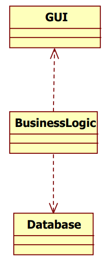
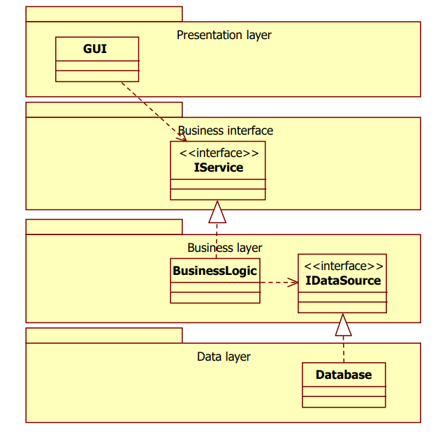

# Tervezési elvek

[Főoldal](oop.md)

  

[Fogalmak](terms.md)

[Minták](patterns.md)

[Heurisztikák](heuristics.md)

[Refaktorálás](refactoring.md)

[Clean-code](cleanCode.md)

[API tervezési elvek](APIDesign.md)

[Elosztott objektumorientáltság](distributed.md)

[Konkurens és párhuzamos minták](concurrentParalell.md)

[Immutable objektumorientáltság](immutable.md)

## Tartalom

  

- [Tervezési elvek](#tervezési-elvek)
  - [Tartalom](#tartalom)
  - [SOLID elvek](#solid-elvek)
    - [Single Responsibility](#single-responsibility)
    - [Open/Closed Principle](#openclosed-principle)
    - [Liskov Substitution Principle](#liskov-substitution-principle)
    - [Interface Segregation Principle](#interface-segregation-principle)
    - [Dependency Inversion Principle](#dependency-inversion-principle)
  - [Egyéb elvek](#egyéb-elvek)
    - [Release Reuse Equivalency Principle](#release-reuse-equivalency-principle)
    - [Common Closure Principle](#common-closure-principle)
    - [Common Reuse Principle](#common-reuse-principle)
    - [Acyclic Dependencies Principle](#acyclic-dependencies-principle)
    - [Stable Dependencies Principle](#stable-dependencies-principle)
    - [Stable Abstractions Principle](#stable-abstractions-principle)
    - [Don’t Repeat Yourself](#dont-repeat-yourself)
    - [Single Choice Principle/Single Point Control](#single-choice-principlesingle-point-control)
    - [Tell, don’t ask](#tell-dont-ask)
    - [Law of Demeter](#law-of-demeter)
    - [YAGNI](#yagni)

---
Olyan tervezési irányelvek és minták amik betartása könnyebben fentarthatóvá és továbbfejleszthetővét teszik a kódot.

A folyamatosan változó követelmények lekövetéséhez remek eszköz. 

Egy rosszul tervezett rendszer:
- Nehzen lehet megváltoztatni, mert egy változtatás sok másik részre van hatással (rigidity)
- A változtatás nem várt részekre hat (fragility)
- Az egyes részeket nehezen lehet önállóan újrahasznosítani (immobility)

Megoldás lehet:
- Függőségek csökkentése
- A függőségek a ritkán változó, stabil részekhez kötődjenek

## SOLID elvek

A SOLID öt fontos elvet jelöl, mindegyik betűje egyre utal. Segítenek csökkenteni a függőséget és növelik a kódbázis fenntarthatóságát.

### Single Responsibility

  

"A class should have only one reason to change"

Minden osztálynak pontosan egy felelőssége (oka a változásra) legyen. Ha több van, azt szét kell osztani.

A szétválasztás több szinten történhet. Implementációs szinten ez két külön álló osztályra bontást jelent. Ha ez nem megoldható, akkor lehet interface szinten végezni a szétválasztást, ekkor a megfelelő interface-eket létre kell hozni, amiket aztán megvalósít az osztályunk.

Nem mindig egyértelmű, hogy egy osztály több okból változhat (több felelőssége van). Fontos elv a YAGNI (You Ain’t Gonna Need It), vagyis, hogy ha valami nem fordul elő, arra nem kell tervezni.

Megsértése esetén bármely felelősség változása, a többi felelősség változtatását vonaj maga után.

Ne sértsük meg!!

### Open/Closed Principle

  

"Software entities (classes, modules, functions etc.) should
be open for extension, but closed for modification.
"

Egy entitásnak nyíltnak kell lennie a kiegészítésre, de zártnak a módosításra.

Az entitás viselkedését meg lehessen változtatni, hogy ezzel követni tudja a követelményeket.

A kiegészítés ne vonja maga után a már létező forráskód módosulását.

Új szereplő megjelenése nagyobb módosítást vonhat maga után.

Megsérthető:
- [Factory Method](patterns.md/#factory-method)
- [Single Choice Principle](#single-choice-principlesingle-point-control)

### Liskov Substitution Principle

  

"Subtypes must be substitutable for their base types"

A leszármazottakat be kell tudni helyettesíteni az őseik helyére, anélkül, hogy ezt a felhasználó észrevenné.

Leszármazás:
- Ami igaz az ősre, az igaz a leszármazottaira is
- Az őse általánosabb a leszármazottnál
- A leszármazott specifkusabb az ősnél
- Bárhol ahol az ős használható, használható a leszármazott

Megsértése típusellenőrzést vonhat maga után és általában az Open/Closed Principle megsértéséhez is vezet.

__Soha ne használjunk leszármazást adat újrahasznosítási céllal! Használjuk a viselkedés újrahasznosítására!__

Ne sértsük meg!!

Függvény Előfeltételek: 
- Feltételei a függvényhívásnak
- pl.: fügvény paramétereinek értékkészlete

Függvény Utófeltételek:
- A függvényhívás után fennálló feltételek
- pl.: fügvény visszatérésének értékkészlete

Osztály Invariánsok (invariants):
- Kényszerek, amiket az osztálynak minden állapotban be kell tartania
- Az osztály saját metódusaival biztosítja őket

Leszármazott függvény előfeltétele nem lehet erősebb őse előfeltételénél és utófeltétele nem lehet gyengébb őse utófeltételénél! Invariánsok erősíthetőek, de nem gyengíthetőek a leszármazottakban!

"Expect no more, provide no less. / Demand no more, promise no less."

A Liskov elv betartása sokszor nem triviális és átfogóbb vizsgálatokat igényelhet.

### Interface Segregation Principle

  

"Clients should not be forced to depend on methods they
do not use"

Az interface-eket szét kell osztani több, kisebb és specifikusabb interface-re, hogy a felhasználó tudja csak azt használni, amire tényleg szüksége van.

Ne merüljön fel függőség olyan részekkel, amikre valójában nincs is szükség.

Megsértése általában a [SRP](#single-responsibility) sértését is jelenti.

Ne sértsük meg!!

### Dependency Inversion Principle

  

"Abstractions should not depend on details. Details should
depend on abstractions."

Magas szintű modulok ne függjenek alacsony szintűektől. Különben az alacsony szintű változások magas szintű változtatásokat igényelnek.

Fordítsuk meg interface-ek segítségével a függőség irányát.

Példa a rossz tervezésre:

    

Az adatbázis vagy a GUI változtatása a logika módosítását vonja maga után. Megoldás:

    

Ne sértsük meg!!

## Egyéb elvek

### Release Reuse Equivalency Principle

  

Az újtafelhasználható elemeket csak akkor szabad használni, ha a készítője kibocsátja, verziószámozza és karbantartja azt. Ezzel biztosítva, hogy minden módosítás és javítás a megfelelő módon jut el a felhasználóhoz, visszafele tartva a kompatibilitást.

Megsértése esetén nem fogják használni az elemet.

Ne sértsük meg!

### Common Closure Principle

  

Azok az osztályok amik együtt változnak összetartoznak. Ezt szervezés szintjén is jelezni kell. Ezek az osztályok tartozzanak egy package-be.

Megsértése nem kívánt függőségeket okoz.

Ne sértsük meg!!

### Common Reuse Principle

  

"Az együtt változó osztályok ugyanabba a csomagba kerüljenek"

Azok az osztályok amik nincsenek együtt fölhasználva, külön legyenek csoportosítva. Csak az jusson el a felhasználhoz, amire tényleg szüksége van. 

Megsértése esetén a változás kiterjedt, nem lokalizált.

Ne sértsük meg!

### Acyclic Dependencies Principle

  

Package-k között ne legyen körkörös függőség! Mindenféle függőséget próbáljunk minimalizálni.

Megsértése esetén, egy package módosítása a többi újravizsgálatát eredményezi.

Ne sértsük meg!

### Stable Dependencies Principle

  

A stabil részektől függjenek a kevésbé stabilak és ne fordítva.

Megsértése esetén a gyakran változó instabil részek a stabil részek változtatását igénylik.

Ne sértsük meg!

### Stable Abstractions Principle

  

A stabil package-k legyenek abstract-ok. Így könnyebben kiegészíthetőek.

Ne sértük meg!

### Don’t Repeat Yourself

  

Kerüljük az ismétlést és duplikációt. Minden adatnak és tudásnak legyen meg a jól meghatározott helye és felelőse. Ha duplikálnánk valamit gondoljuk végig nem lenne-e jobb kiemelni.

Megsértése nem kívánt módosításokat vonhat maga után.

Ne sértsük meg!

### Single Choice Principle/Single Point Control

  

Ha különböző alternatívák támogatása szükséges, akkor ezt pontosan egy, jól meghatározott helyen tegyük.

Megsértése a [DRY](#dont-repeat-yourself) és [OCP](#openclosed-principle) megsértését jelenti. Ha sérül az OCP(típusellenőrzés), fontos, hogy az egy jól meghatároztt helyen sérüljön.

### Tell, don’t ask

  

Egy függvény hívásakor nem a hívó felelőssége a hívott identitás állapotának vizsgálata, hanem a függvényé.

Megsértése a [DRY](#dont-repeat-yourself) megsértéséhez vezethet.

Ne sértsük meg!

### Law of Demeter

  

"Don’t talk to strangers!"

Egy objektum függvénye, csupán az alábbi tulajdonú függvényeket hívja:
- Saját objektum egyéb függvényeit
- Saját objektum adattagjainak publikus függvényeit
- A függvény paramétereinek függvényeit
- A függvény által létrehozott objektumok függvényeit

Kerüljük a láncolt függvényhívásokat! Delegáljuk a többi hívást a következő függvénynek.

Megsértés:
- Ha nagyon sok a delegáló függvény, akkor a sok karbantartás helyett sértsük meg. (miután ellőnőriztük jó a tervezés)

### YAGNI

  

Amire nincs szükség, az nem kell.

Fontos elv a YAGNI (You Ain’t Gonna Need It), vagyis, hogy ha valami nem fordul elő, arra nem kell tervezni.

