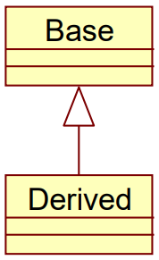
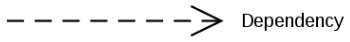
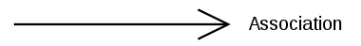
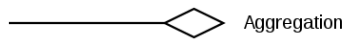
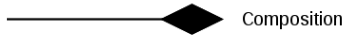
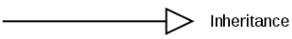
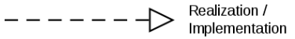

# Fogalmak

[Főoldal](oop.md)

  

[Minták](patterns.md)

[Elvek](principles.md)

[Heurisztikák](heuristics.md)

[Refaktorálás](refactoring.md)

[Clean-code](cleanCode.md)

[API tervezési elvek](APIDesign.md)

[Elosztott objektumorientáltság](distributed.md)

[Konkurens és párhuzamos minták](concurrentParalell.md)

[Immutable objektumorientáltság](immutable.md)

## Tartalom

  

- [OOP](#fogalmak)
  - [Tartalom](#tartalom)
  - [Kérdések](#kérdések)
  - [Fogalmak](#fogalmak)
  - [Tervezési elvek](#tervezési-elvek)
  - [Tervezési minták](#tervezési-minták)
  - [Heurisztikák](#heurisztikák)
  - [Refaktorálás](#refaktorálás)
  - [Clean-code elvek](#clean-code-elvek)
  - [API tervezési elvek](#api-tervezési-elvek)
  - [Elosztott objektumorientáltság](#elosztott-objektumorientáltság)
  - [Konkurens és párhuzamos minták](#konkurens-és-párhuzamos-minták)
  - [Immutable objektumorientáltság](#immutable-objektumorientáltság)

---

## Alapfogalmak

Az alábbi fogalmak vázlatosan vannak definiálva. Alapos ismeretük elengedhetetlen a továbbiakban.

__Class__: Típus

__Object__: Példány

__Static__: Típushoz (class-hoz) tartozik (pl.: változó vagy függvény)

__Abstraction__: A kontextusban nem fontos részletek elhagyása, a való világ modellezése

__Classification__:  Közös tulajdonság alapján történő csoportosítás

__Encapsulation__:  Egységbezárás, egy osztály adattagjait nem lehet kívülről elérni, csak az erre a célra készített függvényeken keresztül

__Inheritance__:  Leszármazás, a leszármazott osztály tudja használni őse viselkedését, nem az adatait

    

__Polymorphism__: A hívó felől el van rejtve az objektum típusa, annyi ismert, hogy egy adott osztály leszármazottja

__Visibility__: Láthatóság

__Virtual method__: A virtuális függvények felülírhatóak a leszármazottakban, ezzel módosítva a leszármazottak viselkedését

__Abstract method__: Nem rendelkezik implementációval

__Abstract class__: Olyan osztály amit nem lehet példányosítani. Általában van abstract függvénye

__Interface__: Egy olyan függvényhalmaz amik nincsenek implementálva. Az interface-t megvalósító osztályoknak kell ezeket implementálni. Egyes nyelvekben nincs külön interface, helyette abstract osztályok és függvények (tisztán virtuális függvény) használhatóak

__Utility Class__: Mindenki számára hasznos,
de senkihez sem hozzárendelhető funkciókat tartalmaznak (matematikai osztályok)

__Interface of a class__: Egy osztály publikus függvényeinek halmaza

__Coupling__: Az összefüggések mértéke. Minél alacsonyabb annál jobb. Az összefüggés azt vonja maga után, hogy ha az egyik rész változik, akkor a másiknak is változnia kell.

__Cohesion__: Annak mértéke, hogy egy adott egységen belül mennyir illenek (logikailag) egymáshoz a részek. Minél magasabb annál jobb

--- 

## Kapcsolatok

Modulok vagy osztályok között előforduló kapcsolatok.

__Dependency__: Két elem függőségét fejezi ki a nyíl irányába (függő felé mutat). Az egyik módosulása maga után vonhatja a másikét

    

__Association__: Gyenge ismeretség a nyíl irányába

    

__Aggregation__: Két objektum élettartalma között fellépő gyenge kapcsolat. Erősebb mint az Association de gyengébb mint a Composition

    

__Composition__: Két objektum élettartalma között fellépő erős kapcsolat. Az egyik megszűnése a másik megsemmisítését vnaj maga után

    

__Generalization/Inheritance__: Leszármazás. Az ős viselkedését örökli a leszármazott

    

__Realization/Implementation__: Megvalósítás

    

## Duck Typing

-  ha valami úgy mozog, mint egy kacsa, és úgy hápog, mint egy kacsa, akkor az egy kacsa
-  erősen típusos nyelvekben nem (nem szépen) megvalósítható
-  c++ban a templetek a paramétereire előírt kényszerek ugyancsak duck typing-ot követnek

## Heterogén kollekció

Problémák:
- leszármazott egyedi függvényének meghívása
- adott függvény hívása csak egyes típusokon

Megoldás:
- [visitor minta](patterns.md/#visitor), sérül az [OCP](principles.md/#open/closed-principle)